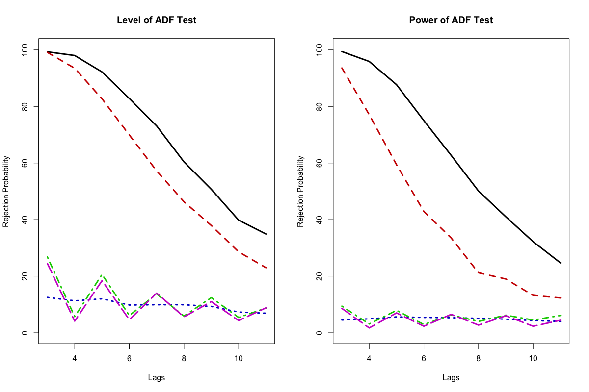

[](http://quantlet.de/index.php?p=info)

## [](http://quantlet.de/) **SFESimADF**[](http://quantlet.de/d3/ia)

```yaml
Name of QuantLet: SFESimADF

Published in: Statistics of Financial Markets

Description: 'Simulates Augmented Dickey-Fuller tests for stationary and non-stationary ARMA processes.
The simulated process x(t) is x(t) = alpha x(t-1) + beta epsilon(t-1) + epsilon(t), where the error 
term is a Gaussian White Noise process. Each process is simulated 1000 times. For each simulated process
the number of lags included for the ADF test varies between 3 to 11.'

Keywords: 
- time series
- ADF
- simulation
- stationary
- explosive
- unit root
- power of test
- level of test
- Augmented Dickey-Fuller

Author: Christoph Schult

Submitted: Mon, May 09 2016 by Christoph Schult

Output: 'A plot for the level (alpha = 0.9) and the power (alpha = 1) of Augmented Dickey-Fuller tests.
The rejection probability for beta = -0.99 (black), beta = -0.90 (red), beta = 0 (blue), beta = -0.90 
(green) and beta = -0.99 (magenta) depending on the number of included lags are displayed. Two tables
are printed for the minimum and maximum number of lags.'

```



```r
# remove variables
rm(list = ls())

# reset graphics
graphics.off()

# Install packages if not installed
libraries = c("tseries")
lapply(libraries, function(Samples) if (!(Samples %in% installed.packages())) {
  install.packages(Samples)
})

# Load packages
lapply(libraries, library, quietly = TRUE, character.only = TRUE)

# === Input Parameters ===
# define number of simulations for ADF test
iSimulations = 1000

# define sample size
iSample = 100

# define alpha parameters
alpha = c(0.9, 1)

# define beta parmaters
beta = c(-0.99, -0.9, 0, 0.9, 0.99)

# define stationary models
statparams = cbind(rep(alpha[1], length(beta)), beta = c(-0.99, -0.9, 0, 0.9, 0.99))

# define explosive models
expparams = cbind(rep(alpha[2], length(beta)), beta = c(-0.99, -0.9, 0, 0.9, 0.99))

# define lag vector
pvec = as.matrix(3:11)

# define significance level
isiglevel = 0.05

# === Define Functions ===
# define function to create simulated process
generateprocess = function(alpha, beta, iSample) {
  epsilon = rnorm(iSample)
  x       = rep(0, iSample)
  for (iCounter in 2:iSample) {
    x[iCounter] = alpha * x[iCounter - 1] + beta * epsilon[iCounter - 1] + epsilon[iCounter]
  }
  return(x)
}

# adftest for varying p
adftestvaryp = function(pvec, x) {
  adftestonep = function(p) {
    return(adf.test(x, alternative = c("stationary"), k = p)$p.value)
  }
  pvalues     = apply(pvec, 1, adftestonep)
  rejection   = as.numeric(pvalues < isiglevel)
  return(rejection)
}

# define function to simulate rejection probabilities
ADFSimtest = function(alpha, beta) {
  res = matrix(rep(NaN, iSimulations, length(pvec)), nrow = iSimulations, ncol = length(pvec))
  for (iSim in 1:iSimulations) {
    x           = generateprocess(alpha, beta, iSample)
    res[iSim, ] = adftestvaryp(pvec, x)
  }
  rejectionprob = colMeans(res)
  return(rejectionprob)
}

# === Main Computation ===
# simulate tests
teststat = mapply(ADFSimtest, statparams[, 1], statparams[, 2])
testexp  = mapply(ADFSimtest, expparams[, 1], expparams[, 2])


# plot level of test
par(mfrow = c(1, 2))
matplot(pvec, teststat * 100, type = "l", lwd = 3, ylab = "Rejection Probability", xlab = "Lags", 
        main = "Level of ADF Test", col = c("black", "red3", "blue3", "green3", "magenta3"), 
        xlim = c(min(pvec), max(pvec)), ylim = c(0, 100))

# plot power of test
matplot(pvec, testexp * 100, type = "l", lwd = 3, ylab = "Rejection Probability", xlab = "Lags", 
        main = "Power of ADF Test", col = c("black", "red3", "blue3", "green3", "magenta3"), 
        xlim = c(min(pvec), max(pvec)), ylim = c(0, 100))

# round results and use only p = 3 and p = 11
tablestationary = round(teststat[c(1, length(pvec)), ], digits = 2)
tableexplosive  = round(testexp[c(1, length(pvec)), ], digits = 2)

tablestatprint  = cbind(c(" ", "alpha", alpha[1], " "), c(" ", "p", pvec[1], pvec[length(pvec)]), 
                        rbind(c(" ", " ", "beta", " ", " "), sapply(beta, as.character), tablestationary))

tableexpprint   = cbind(c(" ", "alpha", alpha[2], " "), c(" ", "p", pvec[1], pvec[length(pvec)]), 
                        rbind(c(" ", " ", "beta", " ", " "), sapply(beta, as.character), tableexplosive))

# print tables
cat("\014")
print(tablestatprint, digits = 2)
print(tableexpprint, digits = 2) 
```
